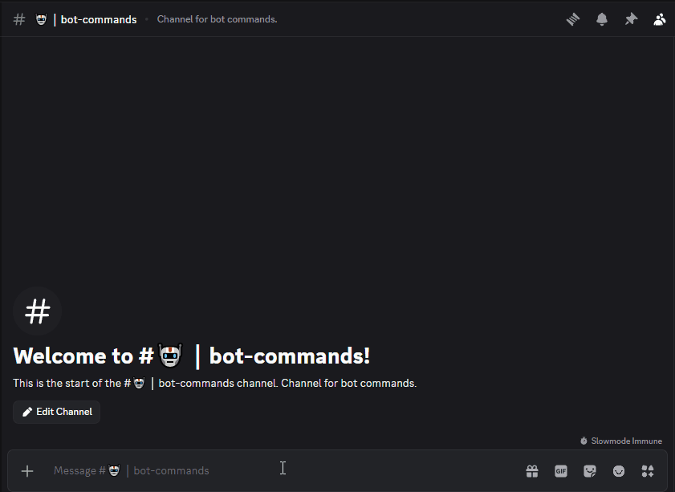

# Coding Tracker

A Discord bot that aggregates your daily competitive programming activity across five platforms into a single command. Built because manually tracking solved problems across LeetCode, Codeforces, CodeChef, HackerRank, and SmartInterviews every day gets old fast.

---

## What it does

Run `/check` in Discord → get a list of every problem you solved today, with direct links, grouped by platform. Works on mobile. Supports date filtering. Handles multiple users independently.

---

## Demo

<p align="center">
  
</p>

---

## Platforms

| Platform | Method | Notes |
|---|---|---|
| LeetCode | Public API | No auth required |
| Codeforces | Public API | No auth required |
| CodeChef | HTML scraping | Fetches up to 5 pages to filter out WA spam |
| HackerRank | Public API | No auth required |
| SmartInterviews | JWT auth | Per-user token, stored securely in DB |

---

## Commands

| Command | Description |
|---|---|
| `/add-profile` | Register a platform account |
| `/remove-profile` | Remove your tracked profile for a platform |
| `/list-profiles` | View all your registered accounts |
| `/check` | Today's solved problems (IST) |
| `/check when:yesterday` | Yesterday's problems |
| `/check date:2026-03-01` | Any specific date |
| `/help` | Command reference |

---

## Stack

**TypeScript · Node.js · PostgreSQL · discord.js · Prisma**

---

## Deployment

### Option 1 — Railway (Recommended)

1. Fork this repo
2. Connect to [Railway](https://railway.app) → New Project → Deploy from GitHub
3. Add the **PostgreSQL** plugin — Railway auto-injects `DATABASE_URL`
4. Set environment variables (see table below)
5. Register slash commands once:
   ```bash
   npx tsx bot/deploy-commands.ts
   ```

Railway Hobby plan runs ~$5/month flat. Actual compute usage is under $0.50.

### Option 2 — Local `.bat` fallback (Windows, free)

For a quick manual check from your PC without the hosted discord bot or database:

1. Double-click `trigger_update.bat` or `manual_trigger_ui.bat`.
2. The script will automatically create a `config.json` file in the folder and close.
3. Open `config.json` and paste your Discord Webhook URL and your usernames into the template.
4. Run the `.bat` file again!

> Webhook URL is found in: Discord server → Settings → Integrations → Webhooks → New Webhook → Copy URL

---

## Environment Variables

| Variable | Required | Description |
|---|---|---|
| `DATABASE_URL` | ✅ | PostgreSQL connection string |
| `DISCORD_BOT_TOKEN` | ✅ | From Discord Developer Portal → Bot |
| `DISCORD_CLIENT_ID` | ✅ | From Discord Developer Portal → General |

---

## SmartInterviews Token Setup

Log into SmartInterviews → F12 → Network tab → any `/api/` request → copy the `authorization` header value (exclude the `"Token "` prefix). Pass it as the `token` option when running `/add-profile`. 

*Note: The bot automatically extracts your true SmartInterviews username directly from the JWT token, so it will work regardless of how you format the username argument in Discord!*

---

## Project Structure

```
├── bot/
│   ├── index.ts                  # Entry point
│   ├── deploy-commands.ts        # Run once to register slash commands
│   ├── tracker.ts                # Core tracking logic
│   └── commands/
│       ├── add-profile.ts
│       ├── remove-profile.ts
│       ├── list-profiles.ts
│       ├── check.ts              # /check + re-check button handler
│       └── help.ts
├── lib/
│   ├── platforms/
│   │   ├── leetcode.ts
│   │   ├── codeforces.ts
│   │   ├── codechef.ts
│   │   ├── hackerrank.ts
│   │   └── smartinterviews.ts
│   └── prisma.ts
├── scripts/
│   └── quick-check.ts            # .bat fallback script
├── prisma/
│   └── schema.prisma
├── railway.toml
├── trigger_update.bat
└── manual_trigger_ui.bat
```

---

*Optimizing for the best time complexity, in code and in life.*
