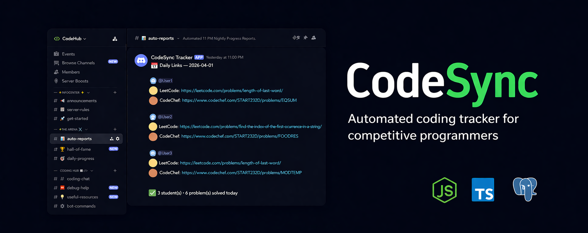
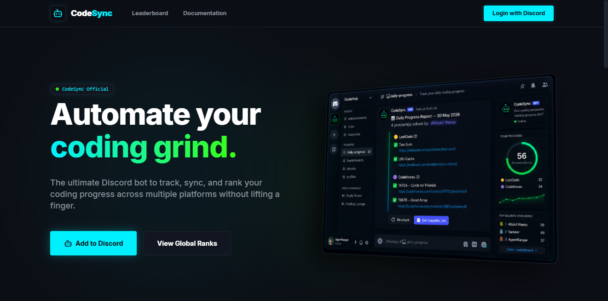
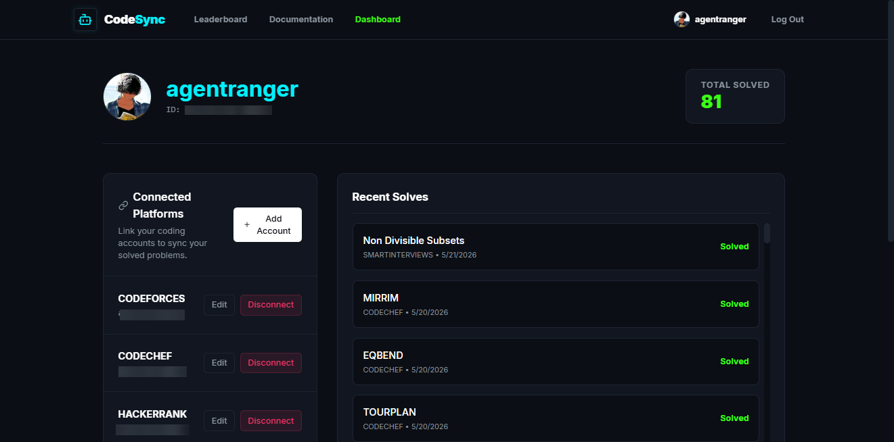
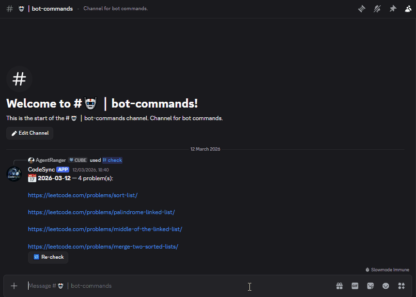
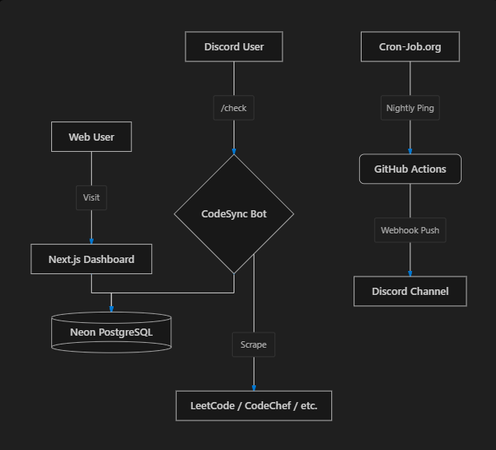

<div align="center">
  
  
  <h1>CodeSync</h1>
  
  <p>
    <strong>A high-performance, autonomous Discord bot and Web Dashboard to track daily coding submissions across multiple platforms.</strong>
  </p>
  
  <p>
    <a href="https://codesync-hub.vercel.app"></a>
    
    
    
    
  </p>
</div>

<hr />

## 📖 The Story

CodeSync was born out of annoyance. Every night, after grinding problems on LeetCode, Codeforces, and CodeChef, students had to manually collect solved problems and paste them into a Discord server. 

What started as a highly-localized `.bat` script running on a single PC evolved into **CodeSync**: a headless, cloud-native Discord bot and full-stack web dashboard serving entire communities. It is built to run autonomously 24/7, tracking competitive programming progress without ever requiring a student to manually copy-paste a link again.

Read the full history in the [CodeSync Story](CODESYNC_STORY.md) and the [Project History](PROJECT_HISTORY.md).

---

## 🌟 Supported Platforms
- **LeetCode**
- **Codeforces**
- **CodeChef**
- **HackerRank**
- **SmartInterviews**

---

## 🚀 Key Features

CodeSync is split into two primary components: the **Discord Bot** and the **Web Dashboard**.

### 💻 The Web Dashboard
The `web/` directory houses a Next.js (v16) application that provides a sleek, flat-design UI (inspired by a classic cyber aesthetic: Deep Space Black, Neon Cyan, and Toxic Green).
- **Global Leaderboard**: View realtime rankings of all registered students based on daily problem solves.
- **Student Profiles**: Interactive dashboards to view individual progress and historical data.
- **NextAuth Integration**: Secure login and session management.

<div align="center">
  
  <br/><br/>
  
</div>

### 🤖 The Discord Bot
A high-performance, 24/7 autonomous bot powered by `discord.js`.
- **Military-Grade Security**: Uses native `crypto` AES-256 to encrypt sensitive platform tokens (like SmartInterviews JWTs) at rest.
- **Zero-Latency Caching**: In-memory caching layer prevents platform IP-bans and serves identical requests in 0ms.
- **Parallel Database Clustering**: `Promise.allSettled` clusters are used to decouple DB writes, ensuring lightning-fast UI responses within Discord.
- **Scheduled Tracking**: A highly reliable `cron-job.org` trigger automatically generates a comprehensive daily report of all students at 11:00 PM IST and pushes it via Webhook.

<div align="center">
  <br />
  
</div>

---

## 🛠️ Bot Commands

| Command | Description |
| --- | --- |
| `/setup` | Server administrators configure tracking and announcement channels. |
| `/add-profile` | Map your Discord account to your coding platform usernames. |
| `/update-profile` | Edit your mapped username or token. |
| `/remove-profile` | Unlink an incorrect platform mapping. |
| `/list-profiles` | Confirm which platforms are currently mapped to your account. |
| `/check [date]` | Generate a personal progress report for today (or a past date). |
| `/leaderboard` | View the top 10 solvers for this week. |
| `/export-report` | Download a CSV of student data for this server. |
| `/refresh` | Force refresh today's scrape globally. |
| `/help` | Display the command list and usage. |

---

## 🏗️ Architecture Map

<div align="center">
  
</div>

---

## 💻 Local Development

### 1. Clone & Install
```bash
git clone <repo-url>
cd coding-platform-tracker
npm install
```

### 2. Environment Variables
Ensure your `.env` contains:
```env
DATABASE_URL="your-neon-postgres-url"
DISCORD_BOT_TOKEN="your-discord-bot-token"
DISCORD_CLIENT_ID="your-discord-client-id"
DISCORD_GUILD_ID="your-discord-server-id"
DISCORD_WEBHOOK_URL="your-channel-webhook-for-testing"
```

### 3. Database Setup
```bash
npx prisma generate
npx prisma db push
```

### 4. Register Slash Commands
Run this once when you add or modify bot commands:
```bash
npm run bot:deploy
```

### 5. Run Locally
```bash
npm run dev
```

---

## ☁️ Deployment Guide (HeavenCloud / Pterodactyl)

To ensure you stay under the 1GB free-tier disk limit, compile the bot locally before uploading:

1. **Compile the code:**
   ```bash
   npm run build
   ```
2. **Create a ZIP file containing ONLY:**
   - `dist/` directory contents
   - `prisma/schema.prisma`
   - `package.json` (Production version without devDependencies)
   - `.env`
3. Upload and extract to HeavenCloud.
4. Set the `MAIN FILE` to `bot/index.js` in the Startup tab.
5. Start the server!

<hr />
<div align="center">
  <p>Built for the community, driven by automation.</p>
</div>
